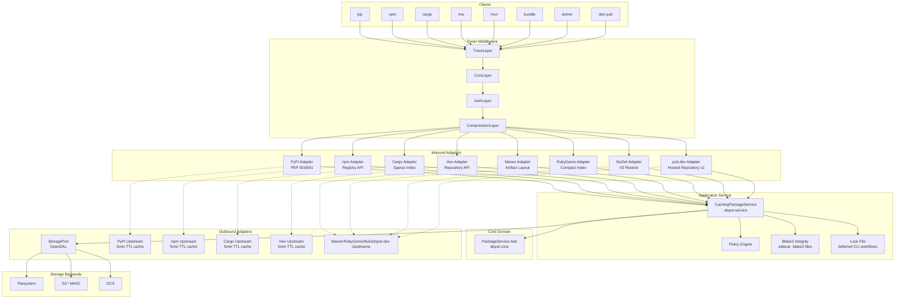
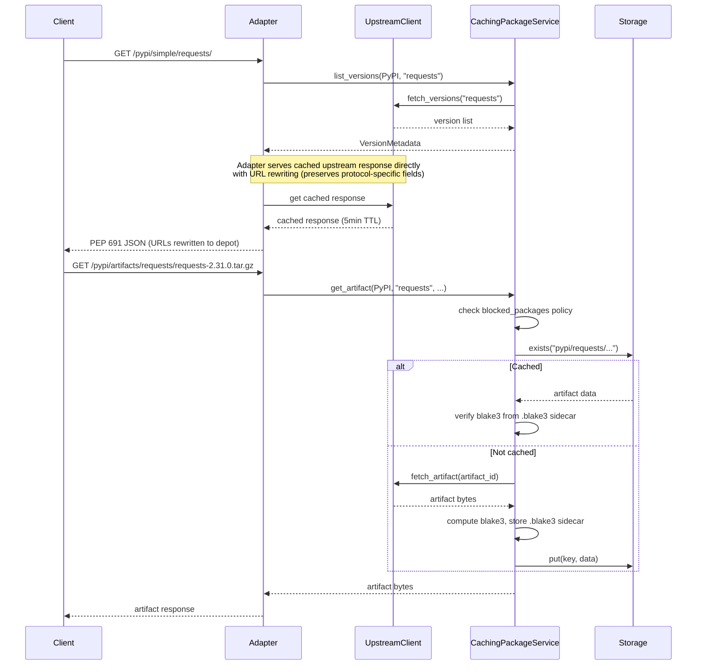
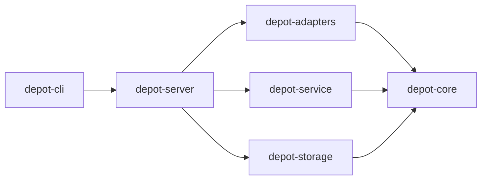

# Architecture

## Overview

Depot is a self-hosted, armored universal package registry. It acts as a pull-through cache and policy enforcement layer between package manager clients and upstream registries.

## Hexagonal Architecture



## Request Flow



## Crate Dependencies



| Crate | Purpose |
|-------|---------|
| `depot-core` | Domain types, port traits (`PackageService`, `StoragePort`, `UpstreamClient`), policy engine, lock file, config |
| `depot-service` | Application service layer. `CachingPackageService`: pull-through caching, blake3 integrity (sidecar `.blake3` files), policy enforcement |
| `depot-storage` | `StoragePort` via OpenDAL — feature-gated backends (fs, S3, GCS, memory) |
| `depot-adapters` | Protocol adapters (axum routers) + upstream clients — feature-gated per ecosystem. Each adapter defines a state trait (`HasPypiState`, etc.) for accessing `PackageService` + upstream client |
| `depot-server` | Axum app assembly, Tower middleware stack, shared `AppState` |
| `depot-cli` | Binary crate, clap CLI: `serve`, `sync`, `lock`, `config` |
| `tests/integration` | Integration test crate with 31 tests covering pip, npm, cargo, and mix client workflows |

## Storage Key Scheme

```text
<ecosystem>/<name>/<version>/<filename>
```

Examples:

- `pypi/requests/2.31.0/requests-2.31.0.tar.gz`
- `npm/lodash/4.17.21/lodash-4.17.21.tgz`
- `cargo/serde/1.0.200/serde-1.0.200.crate`
- `hex/phoenix/1.7.12/phoenix-1.7.12.tar`

## Registry Protocol Support

| Protocol | Spec | Endpoints | Format |
|----------|------|-----------|--------|
| PyPI | PEP 503/691 | `/pypi/simple/<name>/`, `/pypi/artifacts/<name>/<filename>` | JSON (PEP 691) |
| npm | Registry API | `/npm/<package>`, `/npm/<package>/-/<filename>` | JSON (raw `serde_json::Value`, BFS dep prefetch) |
| Cargo | Sparse Index (RFC 2789) | `/cargo/index/<prefix>/<name>`, `/cargo/api/v1/crates/<name>/<version>/download` | NDJSON |
| Hex | Repository API | `/hex/packages/<name>` (JSON + protobuf registry proxy), `/hex/tarballs/<name>-<version>.tar` | JSON / Protobuf |

## Registry Schemas

Canonical schemas for registry protocols and Depot's own formats live in `schemas/`:

```text
schemas/
├── sources.toml
├── manifest.json
├── upstream/
├── registries/
│   ├── pypi.schema.json
│   ├── npm.schema.json
│   ├── cargo.schema.json
│   ├── hex.schema.json
│   ├── nuget-*.schema.json
│   └── pub-package.schema.json
└── depot/
    ├── config.schema.json
    └── lockfile.schema.json
```

Registry schemas are Depot's machine-readable representation of each upstream registry contract when
that contract is JSON-like. The official source for a registry may be JSON Schema, a prose
specification, protobuf definitions, XML Schema, OpenAPI, implementation source, or a combination of
formats. `schemas/README.md` records the source linkage, source format, and conformance-test
expectations for each schema family. `schemas/sources.toml` is the reviewed source index, and
`schemas/manifest.json` is generated by `tools/schema-manager` with content hashes and ownership
metadata.

Registry types derive `JsonSchema` via `schemars` where possible. Representative fixtures and schema
files are validated with `jsonschema` in tests. `task schema:check` verifies committed fetched
artifacts, generated schemas, and manifest hashes without live upstream network drift;
`task schema:check-live` compares fetched artifacts with current upstream sources when maintainers
intentionally want that signal. `task conformance` verifies adapter behavior against local registry
fixtures.
Runtime upstream-response validation is deferred until needed for production hardening.

## ADRs

- [0001 — Hexagonal Architecture](adr/0001-hexagonal-architecture.md)
- [0002 — Tower Middleware](adr/0002-tower-middleware.md)
- [0003 — OpenDAL Storage](adr/0003-opendal-storage.md)
- [0004 — Blake3 & Lock File](adr/0004-blake3-lockfile.md)
- [0005 — Protocol Adapters](adr/0005-protocol-adapters.md)
- [0006 — Feature Flags](adr/0006-feature-flags.md)
- [0007 — JSON Schema Validation](adr/0007-json-schema-validation.md)
- [0008 — Registry Expansion](adr/0008-registry-expansion.md)
