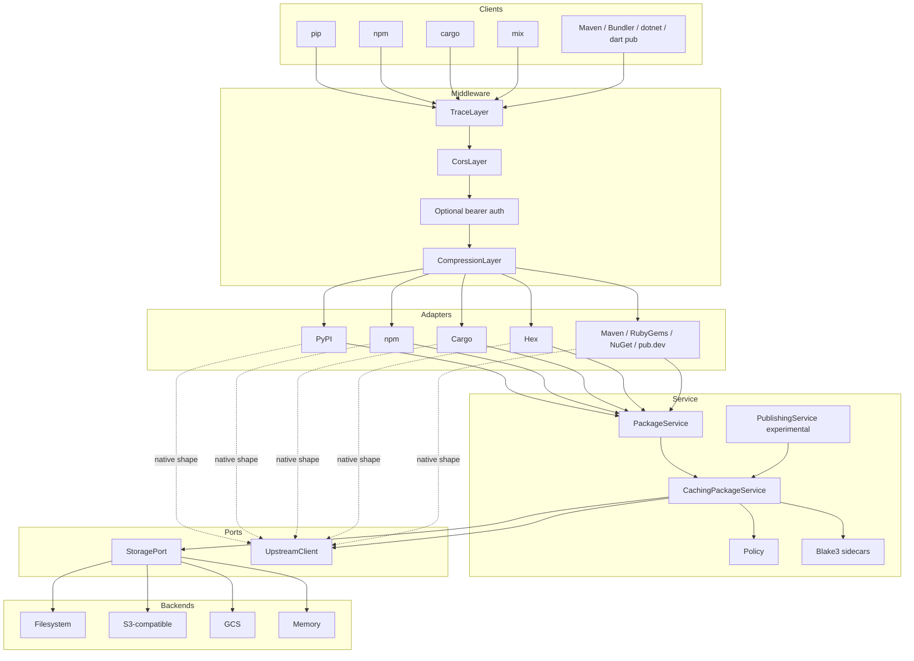
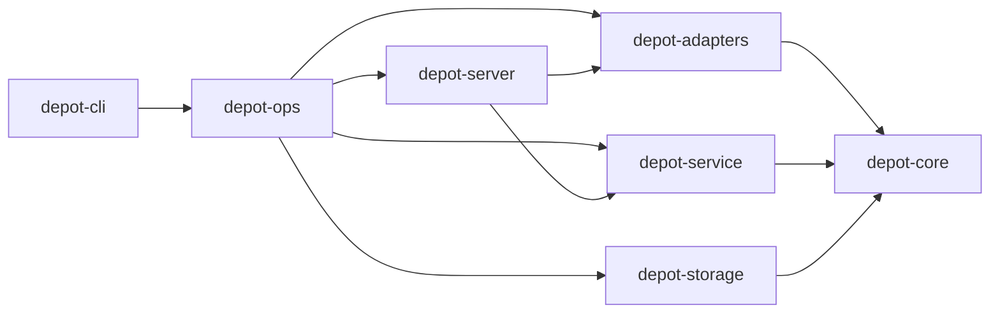
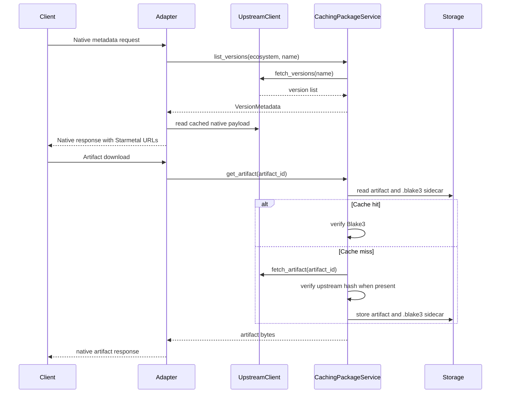

# Architecture

## Overview

Starmetal is a private/internal package registry cache. It speaks native package registry protocols,
stores artifacts through OpenDAL, verifies cached bytes with Blake3 sidecars, and applies policy in
the service layer.

Support is experimental and read/proxy focused:

- PyPI, npm, Cargo, Hex, Maven, RubyGems, NuGet, and pub.dev are experimental core capabilities.
- Native publishing is not supported.
- Local publishing is experimental and disabled by default.

See [ADR-0011](adr/0011-mvp-support-matrix.md) for the support matrix.

## Component Model



## Crate Boundaries



| Crate | Purpose |
|-------|---------|
| `depot-core` | Domain types, config, policy, ports, lock file, registry schema types |
| `depot-service` | Pull-through cache, Blake3 verification, policy checks, experimental local publishing |
| `depot-storage` | OpenDAL `StoragePort` implementation |
| `depot-adapters` | Feature-gated protocol routers and upstream clients |
| `depot-server` | Axum app assembly and Tower middleware |
| `depot-ops` | Shared local runtime and operator operations |
| `depot-cli` | Clap CLI and stdio MCP server |
| `tests/conformance` | Offline schema, protocol, and route conformance tests |
| `tests/integration` | Ignored live native-client E2E tests |

`depot-core` must stay framework-free. All I/O crosses port traits.

## Request Flow



## Registry Read Surface

| Registry | Route prefix | Default enabled | Read status |
|----------|--------------|-----------------|-------------|
| PyPI | `/pypi` | Yes | Experimental core |
| npm | `/npm` | Yes | Experimental core |
| Cargo | `/cargo` | Yes | Experimental core |
| Hex | `/hex` | Yes | Experimental core |
| Maven | `/maven` | Yes | Experimental core |
| RubyGems | `/rubygems` | Yes | Experimental core |
| NuGet | `/nuget` | Yes | Experimental core |
| pub.dev | `/pub` | Yes | Experimental core |

Runtime defaults are defined in `Config::default()`. Full CLI builds compile all adapters, but
compiled does not mean production-supported.

## Publishing Scope

Native publishing is not supported. Existing write routes and `sm package publish` are experimental
local publishing surfaces:

- Disabled by default through `[publishing] enabled = false`.
- Require scoped publish, yank, or admin tokens when enabled.
- Store local metadata and artifacts through `PublishingService`.
- Do not forward uploads upstream.
- Do not provide full owner, organization, invitation, search, or admin behavior.

## Storage

Artifact keys use:

```text
<ecosystem>/<name>/<version>/<filename>
```

Additional service-managed keys include:

- `<artifact>.blake3`
- `<ecosystem>/<name>/_versions.json`
- `<ecosystem>/<name>/<version>/_metadata.json`
- `<ecosystem>/<name>/_raw_upstream`
- `_depot/published/<ecosystem>/<name>/<version>.json`

## Schemas

Schema provenance and generated validation artifacts live in `schemas/`.

```text
schemas/
├── sources.toml
├── manifest.json
├── upstream/
├── registries/
└── depot/
```

Use:

```sh
task schema:check
task schema:validate
task conformance
```

Runtime upstream-response validation is deferred. Schemas support documentation and tests; they do
not create support claims without live E2E evidence.

## ADRs

- [0001 - Hexagonal Architecture](adr/0001-hexagonal-architecture.md)
- [0002 - Tower Middleware](adr/0002-tower-middleware.md)
- [0003 - OpenDAL Storage](adr/0003-opendal-storage.md)
- [0004 - Blake3 and Lock File](adr/0004-blake3-lockfile.md)
- [0005 - Protocol Adapters](adr/0005-protocol-adapters.md)
- [0006 - Feature Flags](adr/0006-feature-flags.md)
- [0007 - JSON Schema Validation](adr/0007-json-schema-validation.md)
- [0008 - Registry Expansion, superseded](adr/0008-registry-expansion.md)
- [0009 - Publishing and Upload Workflows](adr/0009-publishing-upload-workflows.md)
- [0010 - CLI and MCP Operations](adr/0010-cli-mcp-operations.md)
- [0011 - Experimental Support Matrix](adr/0011-mvp-support-matrix.md)
- [0012 - CI Quality Gates](adr/0012-ci-quality-gates.md)
- [0013 - Basemind and AI-Rulez Alignment](adr/0013-basemind-ai-rulez-alignment.md)
