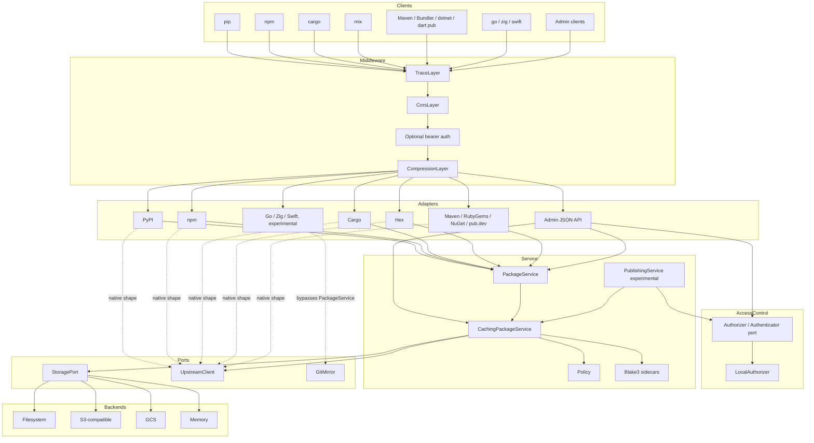
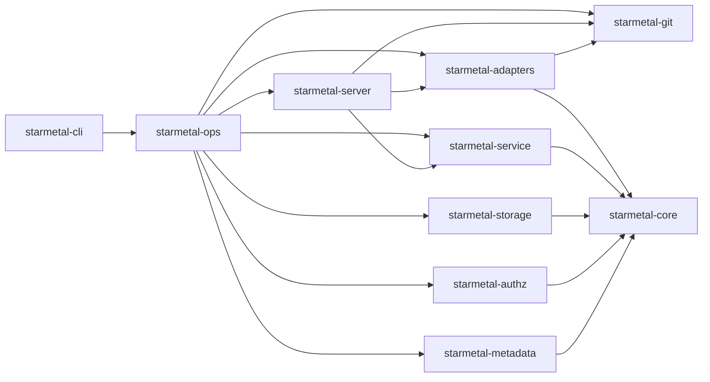
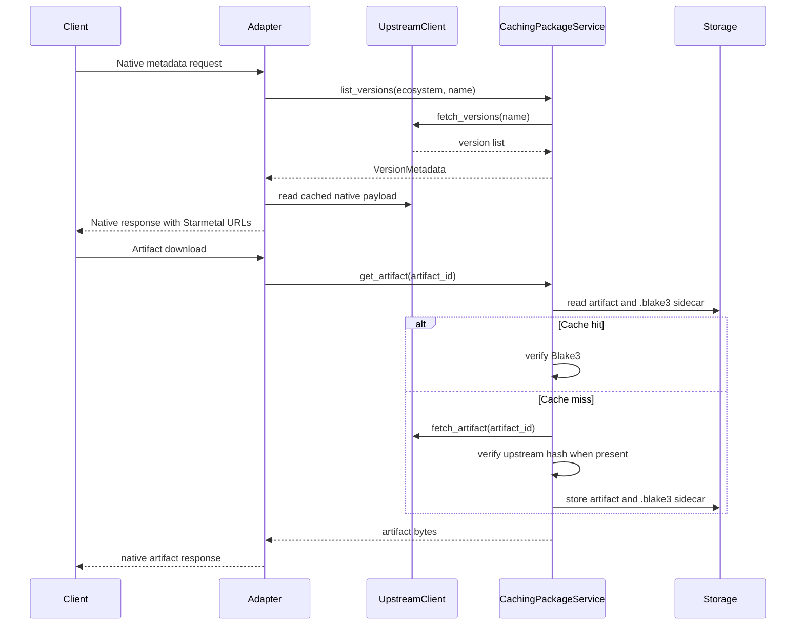

# Architecture

## Overview

Starmetal is a private/internal package registry cache. It speaks native package registry protocols,
stores artifacts through OpenDAL, verifies cached bytes with Blake3 sidecars, and applies policy in
the service layer. A private admin JSON API exposes status, redacted config, cache inventory, and
in-memory metrics when explicitly enabled.

Support is experimental and read/proxy focused:

- PyPI, npm, Cargo, Hex, Maven, RubyGems, NuGet, and pub.dev are experimental core capabilities.
- Go, Zig, and Swift are experimental git-sourced adapters, disabled by default (ADR-0023).
- Native publishing is not supported.
- Local publishing is experimental and disabled by default.

See [ADR-0011](adr/0011-mvp-support-matrix.md) for the support matrix.

## Component Model


```mermaid
graph TB
    subgraph Clients
        pip[pip]
        npm_cli[npm]
        cargo_cli[cargo]
        mix[mix]
        extra_clients[Maven / Bundler / dotnet / dart pub]
        git_clients[go / zig / swift]
        admin_client[Admin clients]
    end

    subgraph Middleware
        trace[TraceLayer]
        cors[CorsLayer]
        auth[Optional bearer auth]
        compress[CompressionLayer]
    end

    subgraph AccessControl
        authorizer[Authorizer / Authenticator port]
        local_authorizer[LocalAuthorizer]
    end

    subgraph Adapters
        pypi[PyPI]
        npm[npm]
        cargo[Cargo]
        hex[Hex]
        extra[Maven / RubyGems / NuGet / pub.dev]
        git_adapters[Go / Zig / Swift, experimental]
        admin[Admin JSON API]
    end

    subgraph Service
        package_service[PackageService]
        caching[CachingPackageService]
        publishing[PublishingService experimental]
        policy[Policy]
        integrity[Blake3 sidecars]
    end

    publishing --> authorizer
    admin --> authorizer
    authorizer --> local_authorizer

    subgraph Ports
        storage[StoragePort]
        upstreams[UpstreamClient]
        git_mirror[GitMirror]
    end

    subgraph Backends
        fs[Filesystem]
        s3[S3-compatible]
        gcs[GCS]
        memory[Memory]
    end

    pip --> trace
    npm_cli --> trace
    cargo_cli --> trace
    mix --> trace
    extra_clients --> trace
    git_clients --> trace
    admin_client --> trace

    trace --> cors --> auth --> compress

    compress --> pypi
    compress --> npm
    compress --> cargo
    compress --> hex
    compress --> extra
    compress --> git_adapters
    compress --> admin

    pypi --> package_service
    npm --> package_service
    cargo --> package_service
    hex --> package_service
    extra --> package_service
    admin --> package_service
    admin --> caching

    pypi -. native shape .-> upstreams
    npm -. native shape .-> upstreams
    cargo -. native shape .-> upstreams
    hex -. native shape .-> upstreams
    extra -. native shape .-> upstreams

    git_adapters -. bypasses PackageService .-> git_mirror

    package_service --> caching
    publishing --> caching
    caching --> policy
    caching --> integrity
    caching --> storage
    caching --> upstreams

    storage --> fs
    storage --> s3
    storage --> gcs
    storage --> memory
```

## Crate Boundaries


```mermaid
graph LR
    cli[starmetal-cli] --> ops[starmetal-ops]
    ops --> server[starmetal-server]
    ops --> service[starmetal-service]
    ops --> storage[starmetal-storage]
    ops --> adapters[starmetal-adapters]
    ops --> authz[starmetal-authz]
    ops --> metadata[starmetal-metadata]
    ops --> git[starmetal-git]
    server --> adapters
    server --> service
    server --> git
    adapters --> git
    adapters --> core[starmetal-core]
    service --> core
    storage --> core
    authz --> core
    metadata --> core
```

| Crate | Purpose |
|-------|---------|
| `starmetal-core` | Domain types, config, policy, ports (including `Authorizer`/`Authenticator`), lock file, registry schema types |
| `starmetal-service` | Pull-through cache, Blake3 verification, policy checks, experimental local publishing |
| `starmetal-storage` | OpenDAL `StoragePort` implementation |
| `starmetal-adapters` | Feature-gated protocol routers and upstream clients |
| `starmetal-git` | `GitMirror` port and its gitoxide-backed implementation (`gix-backend` feature), quarantining git-library access for the Go/Zig/Swift adapters (ADR-0023) |
| `starmetal-server` | Axum app assembly and Tower middleware |
| `starmetal-authz` | `LocalAuthorizer`: deny-by-default `Authorizer`/`Authenticator` implementation migrating flat auth/admin/publishing tokens into a grant model (ADR-0022) |
| `starmetal-metadata` | Postgres-backed content model: component/asset/blob, blake3 dedup, garbage collection, retention (ADR-0020) |
| `starmetal-ops` | Shared local runtime and operator operations |
| `starmetal-cli` | Clap CLI and stdio MCP server |
| `starmetal-update-core` | Framework-free dependency-update domain types and ports (experimental) |
| `starmetal-versioning` | Cargo semver comparison, range membership, and constraint rewriting (experimental) |
| `starmetal-managers` | Cargo.toml manifest parsing and formatting-preserving edits (experimental) |
| `starmetal-forge` | GitHub forge backend over its HTTP API (experimental) |
| `starmetal-updater` | Dependency-update engine: scan and run workflows (experimental) |
| `tests/conformance` | Offline schema, protocol, and route conformance tests |
| `tests/integration` | Ignored live native-client E2E tests |

`starmetal-core` must stay framework-free. All I/O crosses port traits.

## Request Flow


```mermaid
sequenceDiagram
    participant Client
    participant Adapter
    participant UpstreamClient
    participant Service as CachingPackageService
    participant Storage

    Client->>Adapter: Native metadata request
    Adapter->>Service: list_versions(ecosystem, name)
    Service->>UpstreamClient: fetch_versions(name)
    UpstreamClient-->>Service: version list
    Service-->>Adapter: VersionMetadata
    Adapter->>UpstreamClient: read cached native payload
    Adapter-->>Client: Native response with Starmetal URLs

    Client->>Adapter: Artifact download
    Adapter->>Service: get_artifact(artifact_id)
    Service->>Storage: read artifact and .blake3 sidecar
    alt Cache hit
        Service->>Service: verify Blake3
    else Cache miss
        Service->>UpstreamClient: fetch_artifact(artifact_id)
        Service->>Service: verify upstream hash when present
        Service->>Storage: store artifact and .blake3 sidecar
    end
    Service-->>Adapter: artifact bytes
    Adapter-->>Client: native artifact response
```

## Registry Read Surface

| Registry | Route prefix | Default enabled | Read status |
|----------|--------------|-----------------|-------------|
| PyPI | `/pypi` | Yes | Experimental core |
| npm | `/npm` | Yes | Experimental core |
| Cargo | `/cargo` | Yes | Experimental core |
| Hex | `/hex` | Yes | Experimental core |
| Maven | `/maven` | Yes | Experimental core |
| RubyGems | `/rubygems` | Yes | Experimental core |
| NuGet | `/nuget` | Yes | Experimental core |
| pub.dev | `/pub` | Yes | Experimental core |
| Go | `/go` | No (`[go].enabled`) | Experimental, git-sourced |
| Zig | `/zig` | No (`[zig].enabled`) | Experimental, git-sourced |
| Swift | `/swift` | No (`[swift].enabled`) | Experimental, git-sourced |

Runtime defaults are defined in `Config::default()`. Full CLI builds compile all adapters, but
compiled does not mean production-supported.

## Repository Kinds & Facets

`RepositoryKind` (`Proxy`/`Hosted`/`Group`) and a set of capability facets (`ProxyFacet`,
`HostedFacet`, `GroupFacet`) live in `starmetal-core::repository` (ADR-0019). A `RecipeRegistry`
maps `(Ecosystem, RepositoryKind)` to a `Recipe` exposing the facets that kind needs; `build_app`
resolves `Config::resolved_repositories()` and mounts one adapter instance per repository by
looking up its recipe.

- **Proxy** — the existing pull-through cache, unchanged; every ecosystem's default repository.
- **Group** — a read-only virtual repository that merges the proxy members of the same ecosystem
  declared in its `members` list. `AppState::for_group_mount` bakes a per-repository, per-group
  service into the ecosystem's router, so the same adapter code serves both a single proxy and a
  merged group.
- **Hosted** — still rejected by `Config::validate_mvp`: a hosted repository needs
  repository-scoped storage keys (ADR-0021), which are not implemented yet.

Go, Zig, and Swift resolve as `Proxy` repositories but skip the recipe registry entirely — see
below.

## Git as a Dependency Source

Go, Zig, and Swift resolve dependencies from git tags rather than a package-index protocol
(ADR-0023). The `starmetal-git` crate defines an inbound `GitMirror` port — mirror an upstream
repository, list refs, resolve a ref to a commit, read a blob, and produce a source archive — with
a `gix`-backed implementation behind the `gix-backend` feature so the port trait itself stays free
of any git library.

The three adapters read directly through `GitMirror` and bypass `CachingPackageService`, `Policy`,
Blake3 sidecar verification, and `StoragePort` entirely: there is no upstream-metadata cache, no
policy check, and no OpenDAL-backed artifact store in this path, only the `GitMirror`
implementation's own TTL-gated bare-repository mirror. Each adapter translates git tags and trees
into its ecosystem's shape:

- **Go** (`/go`) — the GOPROXY protocol (`@v/list`, `@v/<version>.info`, `@v/<version>.mod`,
  `@v/<version>.zip`), module path mapped to a git URL via `[go].module_overrides` plus a built-in
  github.com/gitlab.com/bitbucket.org/golang.org/x mapping.
- **Zig** (`/zig`) — a single `{host}/{user}/{repo}/{ref}.tar.gz` route serving a source tarball,
  mapped via `[zig].repo_overrides` plus the same built-in host mapping.
- **Swift** (`/swift`) — the Package Registry protocol (SE-0292: list releases, release metadata,
  `Package.swift`, source archive), mapped via `[swift].package_overrides` only — a Swift
  registry identifier carries no host, so every package must be listed explicitly.

All three are disabled by default (`enabled = false` in their respective `[go]`/`[zig]`/`[swift]`
config sections), gated behind the `go`/`zig`/`swift` build features, and proved by a live
native-client end-to-end test rather than HTTP conformance alone: `go mod download`, `zig fetch`,
and `swift package resolve` plus `swift build`. Earlier design work considered serving read-only
git smart-HTTP (`upload-pack`) directly; the shipped adapters translate into each ecosystem's own
protocol instead, and upload-pack proved unnecessary.

## Admin Surface

The admin API is disabled by default and mounted only when `[admin] enabled = true` has at least one
configured token. It requires `Authorization: Bearer <admin-token>` and serves JSON under
`/admin/api/v1` for status, redacted config, registry status, cached packages, cached versions,
cached metadata, and in-memory metrics. See [Configuration](configuration.md) and
[ADR-0014](adr/0014-management-admin-surface.md).

## Publishing Scope

Native publishing is not supported. Existing write routes and `sm package publish` are experimental
local publishing surfaces:

- Disabled by default through `[publishing] enabled = false`.
- Require scoped publish, yank, or admin tokens when enabled.
- Store local metadata and artifacts through `PublishingService`.
- Do not forward uploads upstream.
- Do not provide full owner, organization, invitation, search, or admin behavior.

All eight publish adapters and the admin API authorize through `starmetal-authz`'s `LocalAuthorizer`
(ADR-0022), which migrates the flat `[auth]`/`[admin]`/`[publishing]` token config into a deny-by-default
grant model at startup — there is no separate `[authz]` config section. Read-route gating still uses
the legacy bearer-token check directly.

## Dependency Update Engine

Experimental, Phase 0. A Renovate-style dependency-update engine, scoped to Cargo manifests and
GitHub, lives in five feature-gated crates that mirror the hexagonal split:

| Crate | Role |
|-------|------|
| `starmetal-update-core` | Framework-free update domain types and the `Manager`, `Versioning`, `Datasource`, and `Forge` ports |
| `starmetal-versioning` | `Versioning` implementation for Cargo semver: compare, range membership, diff, constraint rewriting |
| `starmetal-managers` | `Manager` implementation for Cargo.toml: parse dependencies and apply surgical, formatting-preserving edits |
| `starmetal-forge` | `Forge` implementation for GitHub over its HTTP API: read files, create branches/commits, open pull requests |
| `starmetal-updater` | Engine composing the ports into scan-local, scan-remote, and run workflows |

Ports defined in `starmetal-update-core`:

| Port | Direction | Purpose |
|------|-----------|---------|
| `Manager` | Inbound | Detect manifest files, extract dependencies, patch a dependency's value in file text |
| `Datasource` | Outbound | Return available versions and release metadata for a package |
| `Versioning` | Outbound | Parse, validate, and compare versions; test range membership; compute a new constraint value |
| `Forge` | Outbound | Read a repository, create branches/commits, open and update pull requests |

The production `Datasource` implementation is an adapter over `PackageService`, not a direct upstream
client. Update runs therefore query versions through the same cached, Blake3-verified, policy-gated
path the registry proxy already uses. `starmetal-updater` depends on the `PackageService` trait, not
on `starmetal-service` internals.

`starmetal-forge` talks to `api.github.com` through its HTTP API only; it does not use a local git
clone. No forge or HTTP-client dependency reaches `starmetal-update-core`, `starmetal-versioning`, or
`starmetal-managers`.

The `update` CLI feature (included in the `full` build) exposes `sm update scan` and `sm update run`,
composed through `starmetal-ops`. See [ADR-0016](adr/0016-dependency-update-engine.md) and
[ADR-0017](adr/0017-forge-git-port.md) for scope, deferred work, and consequences.

## Storage

Artifact keys use:

```text
<ecosystem>/<name>/<version>/<filename>
```

Additional service-managed keys include:

- `<artifact>.blake3`
- `<ecosystem>/<name>/_versions.json`
- `<ecosystem>/<name>/<version>/_metadata.json`
- `<ecosystem>/<name>/_raw_upstream`
- `_starmetal/published/<ecosystem>/<name>/<version>.json`

## Content Model & Metadata Store

Experimental, disabled by default. `starmetal-metadata` adds an optional Postgres content model
(ADR-0020) alongside the flat object-store keys above: publish dual-writes a `Component → Asset →
Blob` graph, with blobs addressed by their blake3 digest so identical bytes published across
different ecosystems share one stored blob (cross-ecosystem dedup). Reads re-verify blob integrity
against the digest key.

Unreferenced blobs are reclaimed by a reference-counted garbage collector (mark unreferenced blobs,
soft-delete with a grace window, then compact) and by retention policies that delete component
versions matching configured rules (`keep-latest`, `is-prerelease`, `matches-regex`, `last-updated`,
`last-downloaded`). Both GC and retention run on optional interval schedulers and are also exposed as
admin triggers (`POST /admin/api/v1/gc`, `POST /admin/api/v1/retention`). Gated by `[metadata].enabled`
plus the `metadata` build feature (included in `full`). See [Configuration](configuration.md) and
[ADR-0020](adr/0020-content-model-and-garbage-collection.md).

## Supply-Chain Pipeline

Experimental, disabled by default. A `Scanner` port with an OSV-backed implementation gates artifacts
against known vulnerabilities: publish (ingest) rejects an artifact whose worst finding exceeds
`policies.max_vuln_severity`, and, with `enforce_on_serve`, the same threshold gates `get_artifact` at
serve time, scanning on demand and persisting the report as a blake3-keyed sidecar so identical bytes
share one report. A scheduled re-correlation sweep re-scans stored reports against refreshed advisory
data. With `quarantine` enabled, a serve-time block becomes a recoverable hold instead of a terminal
deny, promoted or rejected through admin endpoints (`POST /admin/api/v1/quarantine/{digest}/promote`,
`.../reject`).

Enforcement today is in-service — imperative checks inside `CachingPackageService`, not a Tower
middleware layer. Gated by `[supply_chain].enabled` plus the `scanner-osv` build feature (included in
`full`). See [Configuration](configuration.md), [ADR-0024](adr/0024-supply-chain-security-pipeline.md),
and [ADR-0025](adr/0025-supply-chain-enforcement-architecture.md).

## Schemas

Schema provenance and generated validation artifacts live in `schemas/`.

```text
schemas/
├── sources.toml
├── manifest.json
├── upstream/
├── registries/
└── starmetal/
```

Use:

```sh
task schema:check
task schema:validate
task conformance
```

Runtime upstream-response validation is deferred. Schemas support documentation and tests; they do
not create support claims without live E2E evidence.

## ADRs

- [0001 - Hexagonal Architecture](adr/0001-hexagonal-architecture.md)
- [0002 - Tower Middleware](adr/0002-tower-middleware.md)
- [0003 - OpenDAL Storage](adr/0003-opendal-storage.md)
- [0004 - Blake3 and Lock File](adr/0004-blake3-lockfile.md)
- [0005 - Protocol Adapters](adr/0005-protocol-adapters.md)
- [0006 - Feature Flags](adr/0006-feature-flags.md)
- [0007 - JSON Schema Validation](adr/0007-json-schema-validation.md)
- [0008 - Registry Expansion, superseded](adr/0008-registry-expansion.md)
- [0009 - Publishing and Upload Workflows](adr/0009-publishing-upload-workflows.md)
- [0010 - CLI and MCP Operations](adr/0010-cli-mcp-operations.md)
- [0011 - Experimental Support Matrix](adr/0011-mvp-support-matrix.md)
- [0012 - CI Quality Gates](adr/0012-ci-quality-gates.md)
- [0013 - Basemind and AI-Rulez Alignment](adr/0013-basemind-ai-rulez-alignment.md)
- [0014 - Management Admin Surface](adr/0014-management-admin-surface.md)
- [0015 - Statistics and Operational Metrics](adr/0015-statistics-operational-metrics.md)
- [0016 - Dependency Update Engine](adr/0016-dependency-update-engine.md)
- [0017 - Forge and Git Integration Port](adr/0017-forge-git-port.md)
- [0018 - Universal Artifact Repository Direction](adr/0018-universal-artifact-repository-direction.md)
- [0019 - Repository Kinds and the Recipe/Facet Model, accepted (partial)](adr/0019-repository-kinds-recipe-facet-model.md)
- [0020 - Universal Content Model and Garbage Collection](adr/0020-content-model-and-garbage-collection.md)
- [0021 - Native Hosted Publishing, accepted (partial)](adr/0021-native-hosted-publishing.md)
- [0022 - Access Control Model](adr/0022-access-control-model.md)
- [0023 - Git as a Dependency Source, accepted (partial)](adr/0023-git-as-dependency-source.md)
- [0024 - Supply-Chain Security Pipeline, accepted (partial)](adr/0024-supply-chain-security-pipeline.md)
- [0025 - Supply-Chain Enforcement Architecture (As-Built)](adr/0025-supply-chain-enforcement-architecture.md)
